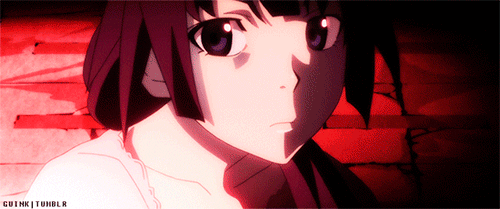

<div align="center">


<br>
<br>


</div>

---

<table>
<tr>
<td width="50%" valign="top">

# ~/about_me.js

```js
const developer = {
    name: "your_name",
    alias: "怪異専門プログラマ",
    location: "Perú 🇵🇪",

    editor: "neovim",
    shell: "zsh",
    wm: "Hyprland",
    os: "Arch Linux",

    languages: [
        "javascript",
        "typescript",
        "python"
    ],

    interests: [
        "Monogatari Series",
        "Linux Ricing",
        "Late Night Coding",
        "Psychological Anime"
    ],

    currentStatus: "coding at 2AM",

    motto: "Tupananchiskama"
}
```

</td>
<td width="50%" valign="top">

# ~/system_info

```bash
OS        : Arch Linux
WM        : Hyprland
Terminal  : kitty
Editor    : Neovim
Shell     : zsh
Theme     : Bakemonogatari

Status    : listening to anime openings
Mood      : sleep deprived
Time      : 03:47 AM
```


</td>
</tr>
</table>

---

# ~/stack.sh

<div align="left">


</div>

---

<table>
<tr>
<td width="50%" valign="top">

# ~/logs.txt

```txt
[00:31] booting terminal
[00:57] changing neovim config
[01:44] fixing css alignment
[02:12] watching bakemonogatari clips
[02:51] debugging javascript
[03:18] git commit -m "final_final_v7"
[03:55] existential crisis
[04:03] back to coding
```

# ~/directory

```bash
📂 code/
📂 configs/
📂 anime/
📂 screenshots/
📂 music/
📂 thoughts.txt
```

</td>
<td width="50%" valign="top">

# ~/currently_playing

```txt
♫ 恋愛サーキュレーション
♫ staple stable
♫ kimi no shiranai monogatari
♫ dark ambient + rain sounds
```



</td>
</tr>
</table>

---

# ~/github_stats

<div align="center">


</div>

---

# ~/aesthetics.css

```css
:root {
    --background: #0b0b0b;
    --red: #d72638;
    --pink: #ff4d6d;
    --soft-pink: #ff85a1;
    --white: #f5f5f5;
    --gray: #7a7a7a;
}
```

---

<div align="center">

> “People have to save themselves.
> One person saving another is impossible.”

### — Oshino Meme

<br>

# 「 君の知らない物語 」

### kimi no shiranai monogatari

<br>

### Tupananchiskama.

</div>
